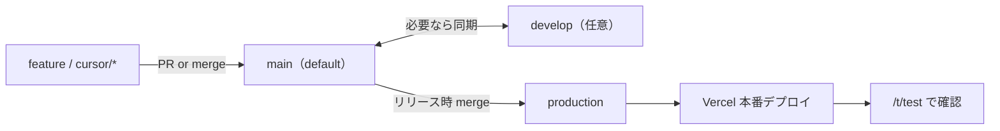

# Git ブランチ運用

リポジトリ: https://github.com/YoseiIkegami/shiori  
デフォルトブランチ: **`main`**（`master` は廃止）

デプロイ先 URL・禁止事項の正本は [`environments.md`](./environments.md)。

## ブランチ一覧

| ブランチ | 種別 | 役割 |
|---|---|---|
| `main` | 恒久 | 開発の集約先。GitHub のデフォルト |
| `develop` | 恒久 | `main` と同内容に揃える作業用（任意） |
| `production` | 恒久 | 本番反映。Vercel Production Branch |
| `cursor/*` など | 短命 | 機能開発・修正用。マージ後に削除可 |

## 全体像



- **フロント本番**は `production` への push で自動デプロイ（Vercel）
- **バックエンド**（Supabase）はブランチと連動しない。反映は明示依頼時のみ
- 本番サイトは全 trip で共通ビルド。検証は常に **`/t/test`**

## 日常の開発

```bash
git checkout main
git pull origin main

git checkout -b cursor/my-feature   # または任意の feature 名
# 実装 …
npm run build                       # マージ前のゲート

git checkout main
git pull origin main
git merge cursor/my-feature
git push origin main
```

- UI 文言は `src/locales/*.json` に集約
- 仕様変更は先に [`SPEC.md`](../SPEC.md) → `docs/` → コードの順

`develop` を使う場合は、`main` と内容を揃えておく（どちらか一方を正とするなら **`main`**）。

## 本番リリース（フロント）

`main` に取り込んだ変更を本番へ出すとき:

```bash
git checkout production
git pull origin production
git merge --ff-only main    # 早送りできないときは merge commit で可
git push origin production
```

push 後、Vercel が `https://shiori.ikg-systems.com` を更新する。

### リリース後の確認

- https://shiori.ikg-systems.com/t/test
- `/t/summer-boardgames` は**触らない・確認にも使わない**

## 手動デプロイ（任意）

`production` を経由せず、作業ツリーから本番ドメインへ出す経路（例: 「テスト環境にデプロイ」）:

```bash
npm run build
npx vercel --prod --yes
```

確認先は同じく `/t/test`。詳細は skill `deploy-test` と [`environments.md`](./environments.md)。

## バックエンドの反映

ブランチ push では Supabase は更新されない。依頼があったときだけ:

```bash
npx supabase functions deploy <name>
npx supabase db push
```

手順: [`backend.md`](./backend.md)、[`environments.md`](./environments.md)

## やってはいけないこと

| 操作 | 理由 |
|---|---|
| 依頼なく `production` へ push | 本番自動デプロイになる |
| 依頼なく `vercel --prod` | 上記と同様 |
| `summer-boardgames` / `test` slug の上書き | 運用・検証用 trip の保護 |
| 本番旅の Supabase データ改変 | 運用データの保護 |

## エージェント（Cursor Cloud）

- 作業ブランチ名は `cursor/<説明>-<suffix>` を推奨
- 本番自動デプロイ・本番 trip 検証は禁止（[`deploy-environments.mdc`](../.cursor/rules/deploy-environments.mdc)）
